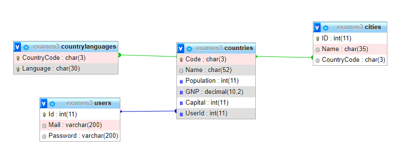

# DAWORLD INVADERS

Durant aquesta prova es durà a terme el desenvolupament d’un joc d’estratègia que consisteix en envair països tenint en compte la correlació de forces de cada jugador, el resultat de la seva execució es pot veure a la següent URL:
 
https://dawsonferrer.com/allabres/mvc/worldGame/Controllers/countriesListController.php
  
Tal com es pot observar disposem d’una pàgina de login, el següent usuari ha sigut creat per defecte. email: prova, password: prova.
 
https://dawsonferrer.com/allabres/mvc/worldGame/Controllers/loginController.php
  
A banda de la pagina de login disposem d’una pàgina de signup que permet crear nous usuaris.
 
https://dawsonferrer.com/allabres/mvc/worldGame/Controllers/signUpController.php
  
La base de dades presenta la següent estructura:

*PRESTAR ESPECIAL ATENCIÓ A MAJÚSCULES I MINÚSCULES
  
Tal com es pot observar a la base de dades, la taula més important és la de countries, on podem trobar el codi de cada país, el seu nom, la seva població, el seu producte interior brut (GNP), la seva capital, i el seu usuari (usuari que ha envaït el país, per defecte NULL). Mentre que les taules cities i countryLanguages són secundaries i estan relacionades directament amb la taula de countries mitjançant claus foranies. La taula users és on nosaltres crearem els nostres usuaris i servirà també per definir a quin usuari pertany cada país, disposem ja d’un usuari de prova tal com s’ha explicat amb anterioritat (usuari creat amb la funció crypt) i que per defecte té el país Andorra.
  
En una primera fase els jugadors podran atacar països de forma individual, de tal forma que el jugador atacarà amb tota la seva força a un sol país, independentment de si pertany a un altre usuari o encara no ha sigut envaït.
Per calcular la força d’un país només cal sumar el seu nombre d’habitants (columna Population) amb el seu producte interior brut (columna GNP), mentre que per calcular la força d’un usuari (atacant), cal sumar les forces (population + GNP) de tots els seus països ja conquerits.
Per tal de començar el joc, un cop es crea un usuari (a la pagina signup) cal que l’aplicació assigni de forma aleatòria un país a l’usuari creat. Per tal de seleccionar un país aleatòriament podeu emprar qualsevol funció aleatòria tal com per exemple RAND() de mysql o random_int () de php. Exemple de consulta SQL:
 
<strong>SELECT Code FROM countries ORDER BY RAND() LIMIT 1;</strong>
  
Un cop es crea un usuari ja es pot iniciar sessió i anar a la pàgina del llistat de països, on podrem atacar països i haurem de desenvolupar la funcionalitat del joc.
  
Per tal de dur a terme aquest examen podeu emprar els manuals oficials de PHP i de MySQL així com fer us de tots els recursos disponibles a la web de W3Schools.
  
P.S.: Aneu per parts, primer importeu la base de dades, després creeu l'estructura de classes, properament passeu a implementar cada pàgina en MVC, aneu pàgina a pàgina, no cal fer consultes complexes en els models, un mateix problema sempre pot ser desglossat en problemes més petits i anar resolent un a un. No abandoneu abans d'hora, <strong style="color:darkred;">gestioneu la frustració</strong> i cerqueu solucions alternatives quan alguna cosa no surti. Ànims i molta sort.