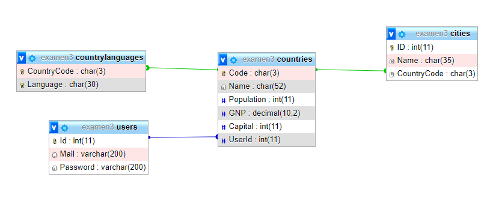

# DAWORLD INVADERS
Durante esta prueba se llevará a cabo el desarrollo de un juego de estrategia que consiste en invadir países teniendo en cuenta la correlación de fuerzas de cada jugador, el resultado de su ejecución se puede ver en la siguiente URL:
 
https://dawsonferrer.com/allabres/mvc/worldGame/Controllers/countriesListController.php
  
Tal y como se puede observar disponemos de una página de login, el siguiente usuario ha sido creado por defecto. email: prova, password: prova.
 
https://dawsonferrer.com/allabres/mvc/worldGame/Controllers/loginController.php
  
Aparte de la página de login disponemos de una página de signup que permite crear nuevos usuarios.
 
https://dawsonferrer.com/allabres/mvc/worldGame/Controllers/signUpController.php
  
Finalmente disponemos de un controlador sin vista para realizar el logout:
 
https://dawsonferrer.com/allabres/mvc/worldGame/Controllers/logoutController.php
  
La base de datos presenta la siguiente estructura:

*PRESTAR ESPECIAL ATENCIÓN A MAYUSCULAS Y MINUSCULAS
  
Tal y como se puede observar en la base de datos, la tabla más importante es la de countries, donde podemos encontrar el código de cada país, su nombre, su población, su producto interior bruto (GNP), su capital, y su usuario (usuario que ha invadido el país, por defecto NULL). Mientras que las tablas cities y countryLanguages son secundarias y están relacionadas directamente con la tabla de countries mediante llaves foráneas. La tabla users es donde nosotros crearemos nuestros usuarios y servirá también para definir a qué usuario pertenece cada país, dispone ya de un usuario de prueba tal y como se ha explicado con anterioridad (usuario creado con la función crypt) y que por defecto tiene el país Andorra.
  
En una primera fase los jugadores podrán atacar países de forma individual, de modo que el jugador atacará con todas sus fuerzas un solo país, independientemente de si pertenece a otro usuario o todavía no ha sido invadido.
Para calcular la fuerza de un país sólo es necesario sumar el número de habitantes (columna Population) con su producto interior bruto (columna GNP), mientras que para calcular la fuerza de un usuario (atacante), hay que sumar las fuerzas (Population + GNP) de todos sus países ya conquistados.
Para empezar el juego, una vez se crea un usuario (en la página signup) es necesario que la aplicación asigne de forma aleatoria un país al usuario creado. Para seleccionar un país aleatoriamente se puede utilizar cualquier función aleatoria tal como por ejemplo RAND() de mysql o random_int() de php. Ejemplo de consulta SQL:
SELECT Code FROM countries ORDER BY RAND() LIMITE 1;
Una vez que se crea un usuario ya se puede iniciar sesión e ir a la página del listado de países, donde podremos atacar a países y deberemos desarrollar la funcionalidad del juego.
  
Para llevar a cabo este examen se puede utilizar los manuales oficiales de PHP y de MySQL así como hacer uso de todos los recursos disponibles en la web de W3Schools.
  
PS: Id por partes, primero importad la base de datos, después cread la estructura de clases, próximamente pasad a implementar cada página en MVC, id página a página, no hace falta hacer consultas complejas en los modelos, un mismo problema siempre puede ser desglosado en problemas más pequeños e ir resolviendo uno a uno. No abandoneis antes de tiempo, <strong style="color:darkred;">gestionad la frustración</strong> y busquad soluciones alternativas cuando algo no salga. Ánimos y mucha suerte.